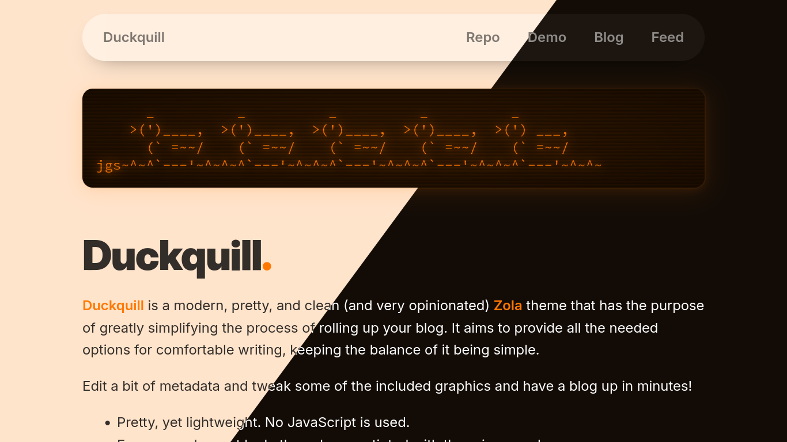

# Duckquill

[Duckquill](https://git.exozy.me/daudix/duckquill) is a modern, pretty, and clean (and very opinionated) [Zola](https://www.getzola.org) theme that has the purpose of greatly simplifying the process of rolling up your blog. It aims to provide all the needed options for comfortable writing, keeping the balance of it being simple.

## Docs

See [duckquill.exozy.me](https://duckquill.exozy.me) for the docs.

## Contribute

If you want to improve Duckquill in any way, feel free to open an issue, or even better, a pull request! I'm happy about every contribution!

The main repo is https://git.exozy.me/daudix/duckquill, but since only exozy.me members can open issues and pull requests, there is two-way mirror at https://next.forgejo.org/daudix-UFO/duckquill, you can open issues and pull requests there just fine.

## Credits

- [Quill image used in the metadata card](https://commons.wikimedia.org/wiki/File:3quills.jpg)

## Thanks to ♥

- [Jakub Steiner](https://jimmac.eu) for the [OS Component Website](https://jimmac.github.io/os-component-website), on top of which this whole thing is built
- [Cassidy James](https://cassidyjames.com) for the [Mastodon-powered Comments](https://cassidyjames.com/blog/fediverse-blog-comments-mastodon)
- [Adobe Fonts](https://github.com/adobe-fonts) for the [Source Code Pro](https://adobe-fonts.github.io/source-code-pro/) font
- [Rasmus](https://rsms.me) for the [Inter](https://rsms.me/inter/) font
- Everyone who supported me and said good stuff <3
